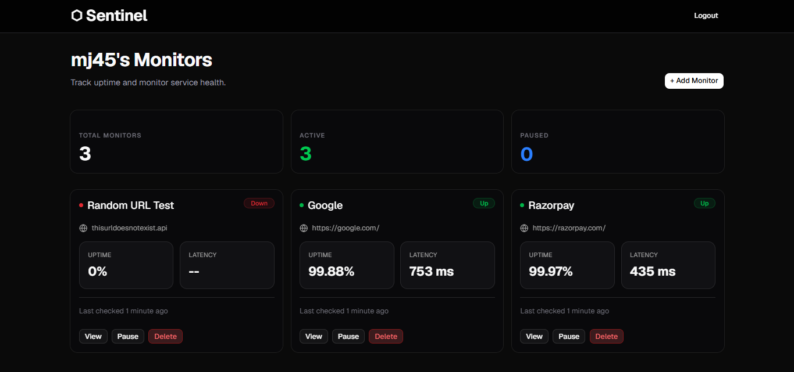
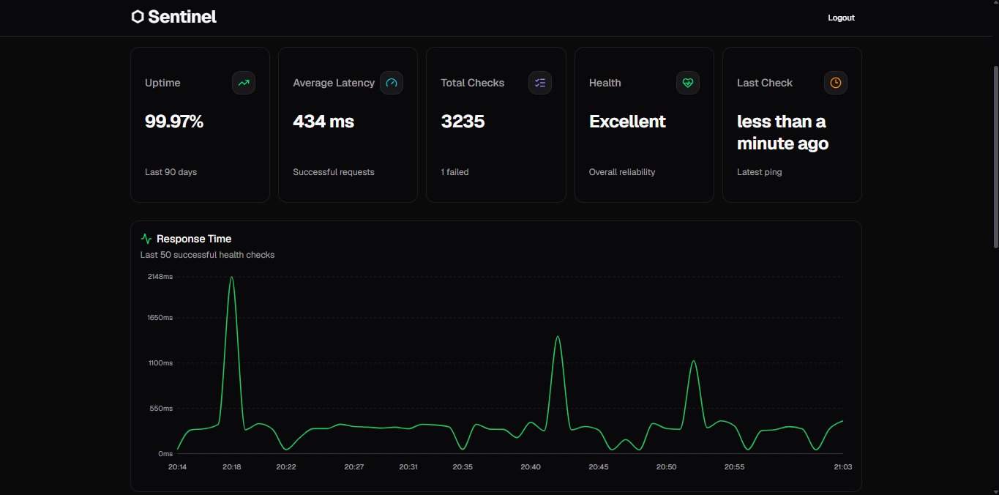
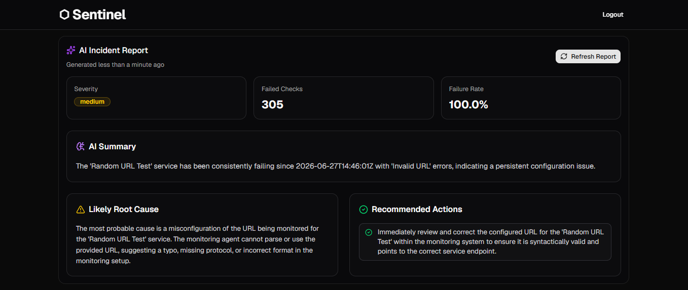
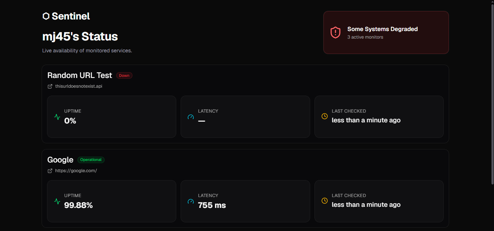

# Sentinel

A full-stack uptime monitoring platform that continuously checks website availability, tracks uptime and response times, and provides shareable public status pages with AI-assisted incident analysis.

**Live demo:** [usesentinel.vercel.app](https://usesentinel.vercel.app)

> Backend API: It's on Render's free tier and spins down when idle, so the first request after inactivity can take 30-60 seconds.

---

## How it works

1. Users create a monitor by providing a URL.
2. A background cron job checks every active monitor once per minute.
3. Each result is stored in PostgreSQL as a ping record.
4. The dashboard, response-time charts, uptime calculations, AI analysis, and public status pages are generated from that historical data.

---

## Features

- Add a URL, Sentinel pings it every 60 seconds via a background cron job — independent of whether anyone's looking at the dashboard
- Tracks uptime %, average response time, and full ping history per monitor
- Pause/resume monitoring without losing history
- Public status page at `/status/:username` — no login needed to view it
- AI incident analysis (Google Gemini) — when a monitor has recent failures, it summarizes the pattern, probable cause, and severity
- Response time chart with downtime events marked separately from latency, so a failure doesn't get visually mistaken for a slow response

---

## Tech stack

**Backend:** Node.js, Express, PostgreSQL (Supabase), JWT auth, bcrypt, node-cron, Google Gemini API

**Frontend:** React (Vite), Tailwind CSS, shadcn/ui, Recharts, React Router

**Deployment:** Render (API), Vercel (frontend), Supabase (database)

---

## A few design decisions

- **PostgreSQL over MongoDB** — the data is relational (a user has many monitors, a monitor has many pings), so foreign keys and joins fit better than a document model.
- **Polling instead of WebSockets** for live updates — pings only happen once a minute, so a 60-second polling interval matches the actual update frequency without the overhead of a persistent connection.
- **Service layer between controllers and the database** — uptime/latency calculations are used in three places (dashboard, monitor detail page, status page), so that logic lives in one shared file instead of being duplicated.
- **AI as an enhancement** — Sentinel's monitoring pipeline works independently of AI. The Gemini integration only analyzes recent failures to provide structured incident summaries, so users can plan their next steps.
---

## Architecture

Sentinel follows a simple relational model. A scheduled cron job records one ping per active monitor every minute, and all uptime metrics, charts, and public status pages are derived from that historical data.

```
users (1) ──── (many) monitors (1) ──── (many) pings
```

- `users` — account info, hashed password, unique username (used in the status page URL)
- `monitors` — URLs being watched, owned by a user, can be paused
- `pings` — one row per check: timestamp, status code, latency, error message if failed

A cron job runs every minute, pings all active monitors, and writes results to `pings`. Uptime %, charts, and the status page are all computed from that table.

---

## Running locally

**Backend**

```bash
git clone https://github.com/agarwal-18/sentinel
cd sentinel
npm install
```

`.env` in the root:

```
DATABASE_URL=your_postgres_connection_string
JWT_SECRET=your_jwt_secret
GEMINI_API_KEY=your_gemini_api_key
FRONTEND_URL=http://localhost:5173
PORT=3000
```

```bash
node index.js
```

**Frontend**

```bash
cd client
npm install
```

`.env` in `client/`:

```
VITE_API_URL=http://localhost:3000
```

```bash
npm run dev
```

---

## What's next

- **Refresh tokens** — JWT currently expires after 7 days with no silent renewal; planning to add a refresh-token flow
- **Email verification and password reset**
- **Rate limiting** on login and the AI endpoint
- **Tests** — starting with the auth flow and the ping/uptime calculation logic
- **Pagination** on ping history once data volume grows past what fits comfortably in one response

---

## Screenshots

**Dashboard**


**Monitor detail**


**AI incident analysis**


**Public status page**
